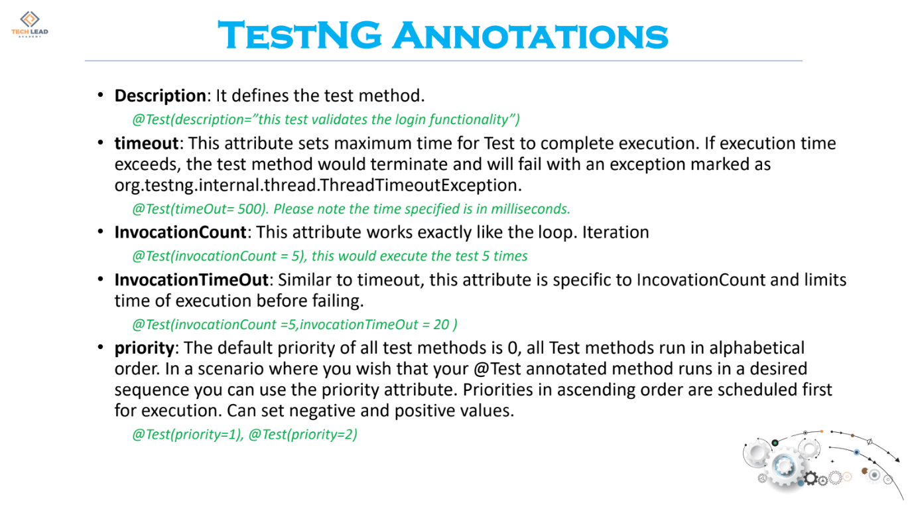

### Data Providers ###

    In TestNG, data providers are methods that provide test data to test cases.
    They are annotated with the @DataProvider annotation and are used to supply data to
    a test method through the @Test annotation's dataProvider attribute. The data provider method
    returns an array of objects, with each set of data representing a separate test iteration.
    The test method is run multiple times, once for each set of data provided by the data provider.
    This allows developers to test their code with different inputs, providing better test coverage.
    The data provider method and the test method can be in the same class or in different classes,
    as long as they are accessible to each other.

